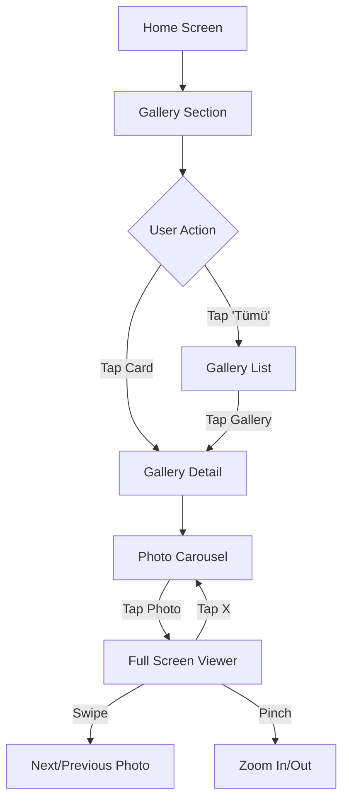

# Gallery Module UI/UX Improvement Plan

## Problem Analysis

After analyzing the current gallery module implementation in [`HomeView.swift`](../YozgatHakimiyet/Views/HomeView.swift:437-513) and [`GalleryDetailView.swift`](../YozgatHakimiyet/Views/GalleryDetailView.swift), I've identified the following design issues:

### Current Issues

1. **Gallery Card Design (Lines 474-513 in HomeView.swift)**
   - Small size (200x150) makes images hard to see
   - Basic badge design with poor contrast
   - No visual depth or elevation
   - Lacks metadata (date, photo count)
   - No hover/press states

2. **Gallery List View (Lines 94-136 in GalleryDetailView.swift)**
   - Simple 2-column grid is monotonous
   - No visual variety or featured items
   - Reuses same card component without optimization for grid view
   - No loading skeleton or empty state

3. **Gallery Detail View (Lines 4-68 in GalleryDetailView.swift)**
   - Shows only single hero image
   - No photo gallery viewer
   - Missing navigation between photos
   - No zoom or full-screen capability
   - No photo metadata or captions

4. **General UX Issues**
   - No loading animations
   - Basic error handling without retry option
   - No transition animations between views
   - Missing pull-to-refresh indicators
   - No image caching strategy mentioned

## Proposed Solution

### 1. Enhanced Gallery Card Component

**Improvements:**
- Larger card size (280x200) for better visibility
- Modern glassmorphism effect for badge
- Gradient overlay for better text readability
- Add photo count badge with camera icon
- Display date and author information
- Smooth scale animation on press
- Shadow and corner radius refinement

**Visual Hierarchy:**
```
┌─────────────────────────────┐
│                             │
│    [Gallery Image]          │
│                             │
│    ┌────────────────┐       │
│    │ Gradient       │       │
│    │ Overlay        │       │
│    │  📷 12 Foto    │       │
│    │  Title         │       │
│    │  📅 Date       │       │
│    └────────────────┘       │
└─────────────────────────────┘
```

### 2. Improved Gallery List View

**Layout Strategy:**
- Adaptive grid: 2 columns on iPhone, 3-4 on iPad
- Featured item at top (full-width card)
- Staggered grid layout for visual interest
- Loading skeleton with shimmer effect
- Empty state with custom illustration
- Infinite scroll or pagination

**Grid Pattern:**
```
┌─────────────────────────────┐
│   Featured Gallery          │
│   (Full Width)              │
└─────────────────────────────┘

┌──────────────┬──────────────┐
│   Card 1     │   Card 2     │
├──────────────┼──────────────┤
│   Card 3     │   Card 4     │
└──────────────┴──────────────┘
```

### 3. Gallery Detail View with Photo Viewer

**New Features:**
- **Horizontal scrollable photo viewer** with page indicators
- **Tap to view full-screen** photo browser
- **Pinch-to-zoom** capability
- **Swipe gestures** for navigation
- **Photo metadata overlay** (photographer, date, caption)
- **Share functionality** for individual photos
- **Download/save options** (if permitted)

**Layout Structure:**
```
┌─────────────────────────────┐
│  [Photo Carousel]           │
│  ← Current Photo →          │
│  ●●○○○ (Indicators)         │
├─────────────────────────────┤
│  Gallery Title              │
│  👤 Author | 📅 Date        │
│  ─────────────────          │
│  Description text...        │
│                             │
│  [Related Galleries]        │
└─────────────────────────────┘
```

### 4. Animation & Interaction Enhancements

**Micro-interactions:**
- Card scale animation on press (0.95x)
- Smooth page transitions with hero animation
- Skeleton loading with shimmer effect
- Pull-to-refresh with custom indicator
- Image fade-in after loading
- Haptic feedback on interactions

**Transitions:**
- Hero image transition from list to detail
- Slide animation for photo carousel
- Fade animation for metadata overlay
- Spring animation for card interactions

### 5. Error Handling & Loading States

**Loading States:**
```swift
// Skeleton loader for cards
RoundedRectangle(cornerRadius: 12)
    .fill(Color.gray.opacity(0.3))
    .shimmer() // Custom shimmer modifier
```

**Error States:**
- Retry button with icon
- Friendly error messages
- Offline mode indicator
- Failed image placeholder with retry

### 6. Performance Optimizations

**Image Loading:**
- Use `LazyVGrid` for efficient grid rendering
- Implement image caching layer
- Load thumbnail first, then high-res
- Progressive image loading
- Memory management for large galleries

## Implementation Structure

### New Components to Create

1. **`EnhancedGalleryCard.swift`**
   - Modern card design
   - Animated interactions
   - Metadata display

2. **`PhotoViewerView.swift`**
   - Full-screen photo browser
   - Zoom and pan gestures
   - Photo navigation controls

3. **`GalleryCarouselView.swift`**
   - Horizontal scrolling carousel
   - Page indicators
   - Auto-play option

4. **`LoadingSkeletonView.swift`**
   - Reusable skeleton loader
   - Shimmer animation effect

5. **`EmptyStateView.swift`**
   - Custom empty state UI
   - Retry action

### Files to Modify

1. **[`HomeView.swift`](../YozgatHakimiyet/Views/HomeView.swift)**
   - Update `GallerySection` (lines 438-471)
   - Replace `GalleryCard` with enhanced version (lines 474-513)

2. **[`GalleryDetailView.swift`](../YozgatHakimiyet/Views/GalleryDetailView.swift)**
   - Add photo carousel (lines 12-23)
   - Implement full-screen viewer
   - Enhance metadata display (lines 25-51)
   - Update `GalleryListView` grid (lines 101-112)

3. **[`Models/Gallery.swift`](../YozgatHakimiyet/Models/Gallery.swift)**
   - Potentially add photo count property if available from API
   - Add helper methods for formatting

## Design System

### Colors
```swift
// Gallery-specific colors
static let galleryBadge = Color.black.opacity(0.6)
static let galleryGradient = LinearGradient(
    colors: [.clear, .black.opacity(0.8)],
    startPoint: .top,
    endPoint: .bottom
)
```

### Typography
```swift
// Gallery card
.font(.headline) // Title
.font(.caption) // Metadata
.font(.caption2) // Badge

// Detail view
.font(.title2) // Gallery title
.font(.body) // Description
```

### Spacing
```swift
let cardCornerRadius: CGFloat = 16
let cardSpacing: CGFloat = 16
let cardPadding: CGFloat = 12
let cardShadowRadius: CGFloat = 8
```

## API Considerations

Based on [`APIService.swift`](../YozgatHakimiyet/Services/APIService.swift), the available endpoints are:
- `galleries` - All galleries
- `galleries/latest/:limit` - Latest galleries with limit
- `galleries/featured` - Featured galleries
- `galleries/:id` - Single gallery detail

**Note:** The current API may only return single gallery image. If the API supports multiple photos per gallery, we need to:
1. Update the [`Gallery`](../YozgatHakimiyet/Models/Gallery.swift) model to include photos array
2. Add new endpoint for fetching gallery photos if needed

## User Experience Flow



## Success Metrics

After implementation, the gallery module should achieve:
- ✅ Modern, appealing visual design
- ✅ Smooth 60fps animations
- ✅ Intuitive photo browsing experience
- ✅ Clear information hierarchy
- ✅ Fast image loading with caching
- ✅ Responsive layout on all device sizes
- ✅ Accessible for all users

## Next Steps

1. Get approval for this design direction
2. Create mockups or prototypes if needed
3. Implement components in priority order
4. Test on various devices and screen sizes
5. Gather user feedback
6. Iterate based on feedback
